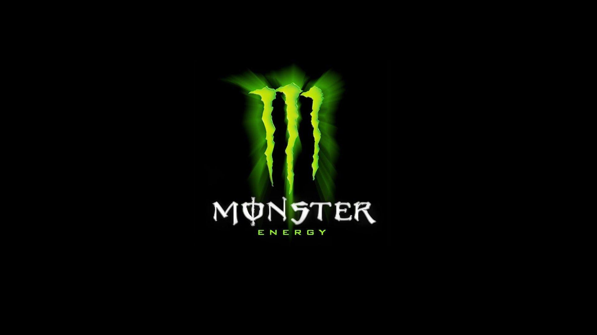

Monster Energy is an American energy drink based company created in 1935, with the name Hansen’s, and rebranded into what we know today in 2012. Monster Energy is the second-best-Selling energy drink in the world after Red Bull and has over 34 different flavors.

For the following typography analysis, we will examine their black and green logo. Firstly, we can see the Alignment of the body of text, here the text is centered below the logo with two different types of fonts and sizes, giving it a smooth contrast between the words. This alignment also allows for a great composition between the text and the logo. Next, the colors have an impact on how the design is presented, here they mainly use 3 colors, green for the lower text and logo, white for the brand’s name, and black for the background. These colors send a message of energy by increasing the saturation and value of the color green, giving an energetic vibe in contrast to the darker background.

Furthermore, the fonts used on this logo are custom made and give two excellent texts that show this brand. The first one “Monster”, plays between the Organic and Digital typographic voice but ends up leaning towards the organic side from its smooth and casual font. It also plays between the tentative and Emphatic voices but with its custom image (especially on the O) and boldtypography it ends up more emphatic. On the other side, we have the lower text “Energy”, which has sharper edges and a more digital typographic voice that plays nicely with its more rigid form. Similarly, it also leans for an Emphatic voice giving it a nice composition with the other text.