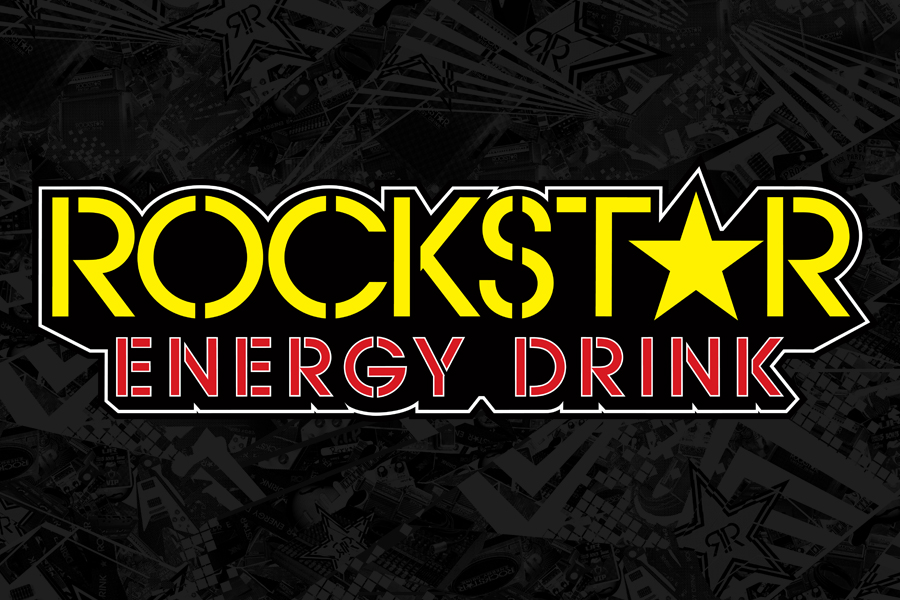

Rockstar is an American energy drink based company created in 2001 and was bought by PepsiCo in 2020 for $3.85 billion US Dollars. Rockstar Energy is available in over 30 countries and has over 20 flavors.

For the following typography analysis, we will examine their original logo. Firstly, we can see the Alignment of the body of text which is composed of two different types of fonts and sizes giving it a serious but youthful contrast between the words. This alignment also allows for a great composition between the two separate words. Interestingly, this geometric sans serif typeface was designed by Herb Lubalin and Tom Carnase in 1970. Next, the colors have an impact on how the design is presented, here they mainly use 3 colors, red for the lower text, yellow for the brand’s name, and black for the outline. These colors send a message of energy by increasing the saturation and value of the colors and with its bright colors it tries to gather attention and show youthfulness.

Furthermore, the fonts used for Rockstar are based on the logo Lubalin created for Avant Garde magazine and gives two excellent fonts that show this brand's goal. The first one “Rockstar”, uses a digital typographic voice for its sharp edges and uppercases, here there is almost no organic voice. It also plays between the tentative and Emphatic voices but with its custom image (The A or star) and boldtypography it ends up more emphatic. On the other side, we have the lower text “Energy Drink”, which has sharp edges and a similar digital typographic voice which plays nicely with its more rigid form. Similarly, it also leans for an Emphatic voice giving it a nice composition with the other text and with the overall dark outline.