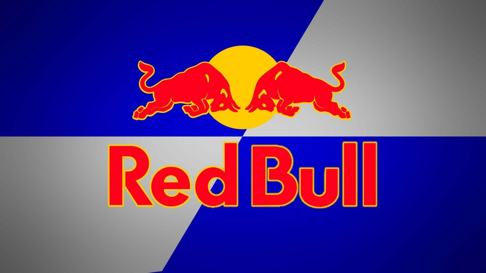

Red Bull is an Austrian energy drink based company created in 1980, It is the largest Energy drink company in the world being available in over 100 countries and selling over 6000 drinks each year. This company is also very well known for sponsoring sports like Mountain Bike, Windsurf, Free Climbing and Parkour. 

For the following typography analysis, we will examine Its Blue and Silver logo. Firstly, we can see the Alignment of the body of text, here the text is centered below the logo with a bold type of font and size, giving it a smooth contrast between the words and the logo. This alignment also allows for a great composition between the text and the bull. Next, the colors have an impact on how the design is presented, here they mainly use 4 colors, silver, and blue for the background and  Red for the brand’s name and logo. These colors send a message of energy by showing the Bright and metallic colors like silver, giving an energetic vibe in with the playful red and blue with a bit of yellow in the center to call attention. 

Furthermore, the fonts used on this logo are custom made and give two excellent texts that show this brand. The first one “Red Bull”, plays between the Organic and Digital typographic voice but ends up leaning towards the organic side from its smooth and casual font. It also plays between the tentative and Emphatic voices showing the bold typography making it end up more emphatic. On the other side, we have the upper logo which has sharper edges and a more digital typographic voice that plays nicely with its more rigid form. Similarly, it also leans for an Emphatic voice giving it a nice composition with the text.